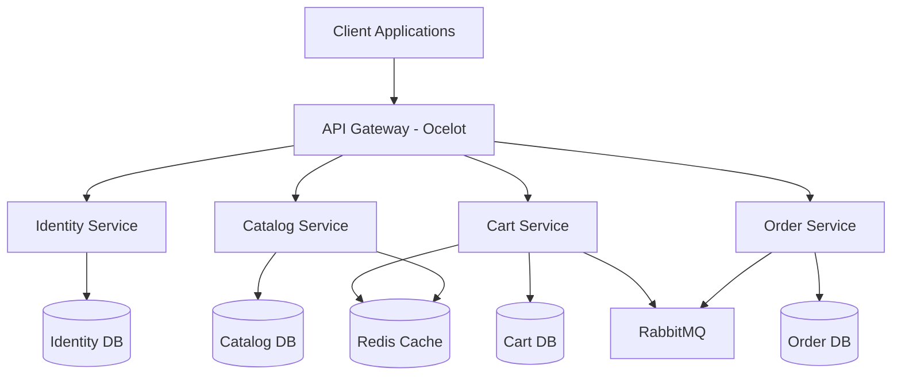

# 📚 Online Book Store Microservices

[](https://dotnet.microsoft.com/download)
[](https://www.docker.com/)
[](https://www.postgresql.org/)
[](https://www.rabbitmq.com/)
[](https://redis.io/)

A robust, scalable online bookstore platform built using microservices architecture. This project demonstrates modern software architecture patterns and best practices for building distributed systems.

## 🏗️ Architecture Overview

The system is composed of five microservices:



## 🚀 Features

### Identity Service
- User registration and authentication
- JWT token generation and validation
- Role-based access control
- User profile management

### Catalog Service
- Book inventory management
- Category and author management
- Search and filtering capabilities
- Redis caching for popular items

### Cart Service
- Shopping cart management
- Price calculation
- Redis-based session management
- Real-time inventory validation

### Order Service
- Order processing and management
- Payment integration
- Order history and tracking
- Async communication with Cart service

### API Gateway
- Request routing and aggregation
- Authentication middleware
- Rate limiting
- Load balancing

## 🛠️ Prerequisites

- [.NET 8 SDK](https://dotnet.microsoft.com/download)
- [Docker Desktop](https://www.docker.com/products/docker-desktop)
- [PostgreSQL](https://www.postgresql.org/download/)
- [Redis](https://redis.io/download)
- [RabbitMQ](https://www.rabbitmq.com/download.html)

## 📦 Installation

1. Clone the repository:
```bash
git clone https://github.com/yourusername/online-bookstore-microservices.git
cd online-bookstore-microservices
```

2. Start the infrastructure services using Docker Compose:
```bash
docker-compose up -d
```

3. Configure environment variables:
```bash
cp .env.example .env
# Edit .env file with your configuration
```

4. Apply database migrations:
```bash
dotnet ef database update --project src/Services/Identity/Identity.API
dotnet ef database update --project src/Services/Catalog/Catalog.API
dotnet ef database update --project src/Services/Cart/Cart.API
dotnet ef database update --project src/Services/Order/Order.API
```

5. Run the services:
```bash
dotnet run --project src/Services/Identity/Identity.API
dotnet run --project src/Services/Catalog/Catalog.API
dotnet run --project src/Services/Cart/Cart.API
dotnet run --project src/Services/Order/Order.API
dotnet run --project src/ApiGateway/ApiGateway
```

## 🔑 Environment Configuration

```dotenv
# PostgreSQL Configuration
POSTGRES_USER=admin
POSTGRES_PASSWORD=your_password
POSTGRES_HOST=localhost

# Redis Configuration
REDIS_HOST=localhost
REDIS_PORT=6379

# RabbitMQ Configuration
RABBITMQ_HOST=localhost
RABBITMQ_USER=guest
RABBITMQ_PASS=guest

# JWT Configuration
JWT_SECRET=your_jwt_secret_key
JWT_ISSUER=your_issuer
JWT_AUDIENCE=your_audience
```

## 📚 API Documentation

### Identity Service API
| Endpoint | Method | Description |
|----------|--------|-------------|
| `/api/auth/register` | POST | Register new user |
| `/api/auth/login` | POST | Authenticate user |
| `/api/auth/refresh` | POST | Refresh JWT token |

### Catalog Service API
| Endpoint | Method | Description |
|----------|--------|-------------|
| `/api/books` | GET | Get all books |
| `/api/books/{id}` | GET | Get book by ID |
| `/api/books` | POST | Add new book |
| `/api/categories` | GET | Get all categories |

### Cart Service API
| Endpoint | Method | Description |
|----------|--------|-------------|
| `/api/cart` | GET | Get user's cart |
| `/api/cart/items` | POST | Add item to cart |
| `/api/cart/items/{id}` | DELETE | Remove item from cart |

### Order Service API
| Endpoint | Method | Description |
|----------|--------|-------------|
| `/api/orders` | GET | Get user's orders |
| `/api/orders` | POST | Create new order |
| `/api/orders/{id}` | GET | Get order details |

## 🔧 Troubleshooting

### Common Issues

1. **Services can't connect to PostgreSQL**
   - Check if PostgreSQL is running: `docker ps | grep postgres`
   - Verify connection string in `appsettings.json`
   - Ensure database migrations are applied

2. **RabbitMQ Connection Issues**
   - Verify RabbitMQ is running: `docker ps | grep rabbitmq`
   - Check credentials in environment variables
   - Ensure firewall allows connection to RabbitMQ port

3. **Redis Connection Timeout**
   - Confirm Redis is running: `docker ps | grep redis`
   - Check Redis connection string
   - Verify network connectivity

## 🤝 Contributing

1. Fork the repository
2. Create your feature branch: `git checkout -b feature/my-feature`
3. Commit your changes: `git commit -am 'Add new feature'`
4. Push to the branch: `git push origin feature/my-feature`
5. Submit a pull request

Please read [CONTRIBUTING.md](CONTRIBUTING.md) for detailed guidelines.

## 🗺️ Roadmap

- [ ] Implementation of payment gateway integration
- [ ] Add support for multiple currencies
- [ ] Implement real-time notifications
- [ ] Add support for book reviews and ratings
- [ ] Implement recommendation engine
- [ ] Add support for e-books
- [ ] Implement advanced search functionality

## 📞 Contact

- Project Maintainer: [Your Name](mailto:your.email@example.com)
- Twitter: [@yourusername](https://twitter.com/yourusername)
- LinkedIn: [Your Name](https://linkedin.com/in/yourusername)

## 📄 License

This project is licensed under the MIT License - see the [LICENSE](LICENSE) file for details.

---

⭐ If you find this project useful, please consider giving it a star!